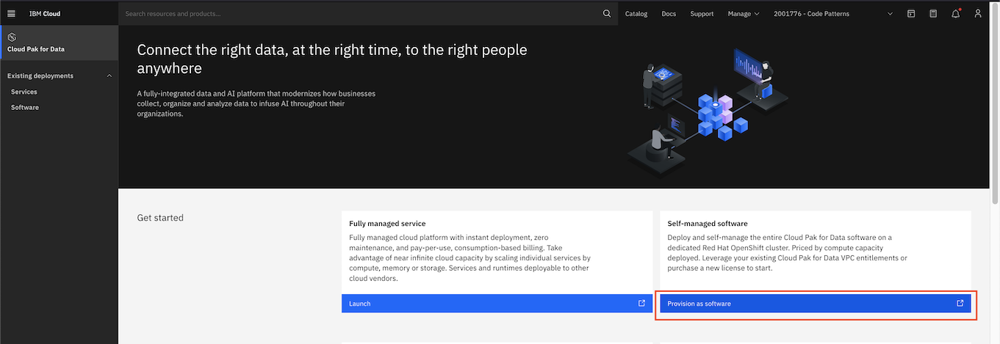
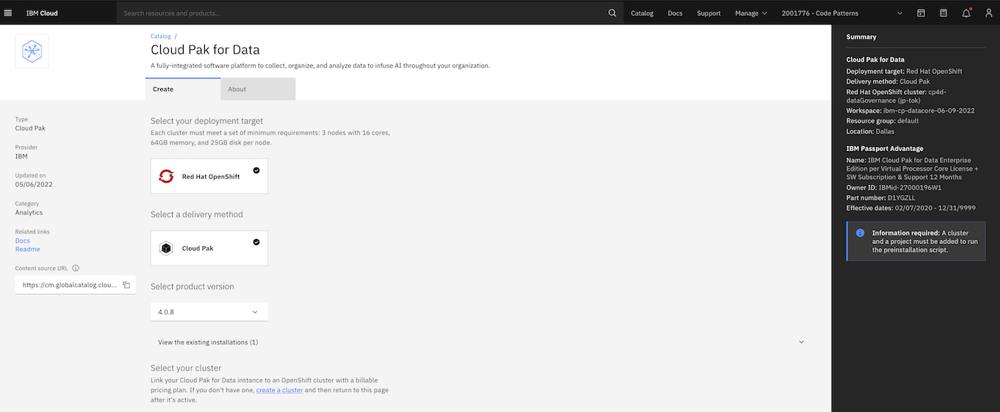

### Create DB2, Watson Knowledge Studio and Watson Query on the self managed software mode for Cloud Pak for Data service

#### 1. Install Cloud Pak for Data
Login to IBM Cloud. Go to https://cloud.ibm.com/cloudpaks/data/overview.

Click on `Provision as software`.

Please ensure that options to install  DB2, Watson Knowledge Studio, Watson Query and Watson Assistant are selected. After configuring all the pre-requisite details, click `Install`.

For more details on the installation process refer this [link](https://www.ibm.com/docs/en/cloud-paks/cp-data/4.0?topic=installing).

#### 2. Note down credentials for Db2 and Watson Query.

Open Db2 console and note down Db2 access credentials.

Open the Watson Query console. Select `Connection details` in the dropdown menu. Note the `Host name`, `Port` and `JDBC string`. This will be required for viewing the data on `Watson Knowledge Studio` and also chatbot application.

