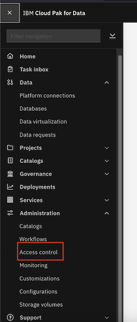
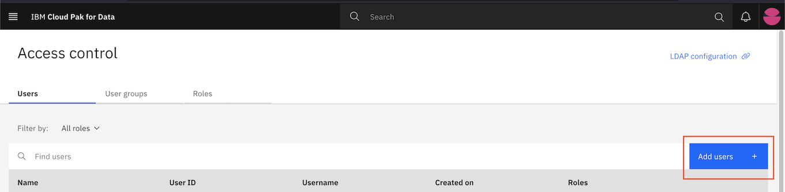
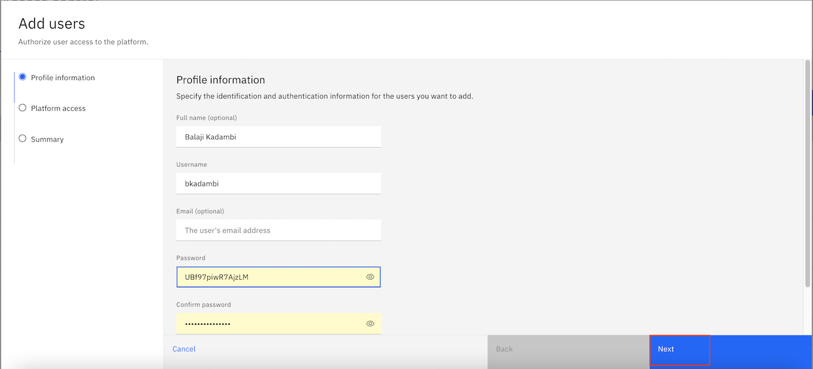
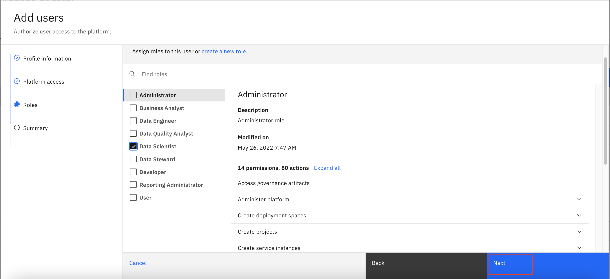
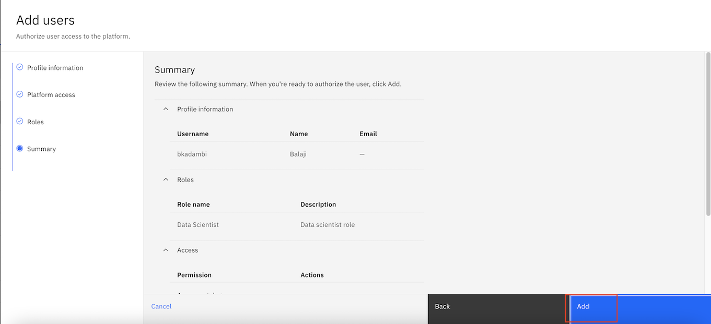

## Set up account for collaborating user and provide access to Watson Knowledge Catalog and Watson Query

### 1. Set up user
An account for the collaborating user which in our case is the chatbot application needs to be set up.

Go to `Access Control` on the Cloud Pak for Data Console.

Click on `Add users`.

Enter profile information and click `Next`.

Select `Data Scientist` role since the user is needed for the chatbot application.

Click `Add` to add the user.

### 2. Provide Access to Watson Knowledge Catalog and Watson Query

- Open the Watson Knowledge Catalog console. Open the new catalog `InsClCatalog`. Click on `Access` tab and provide collaborator access to the new user created.
- Open the Watson Query console. Select `User management` in the dropdown list menu. Click on `Grant access` and provide collaborator access to the new user created.
