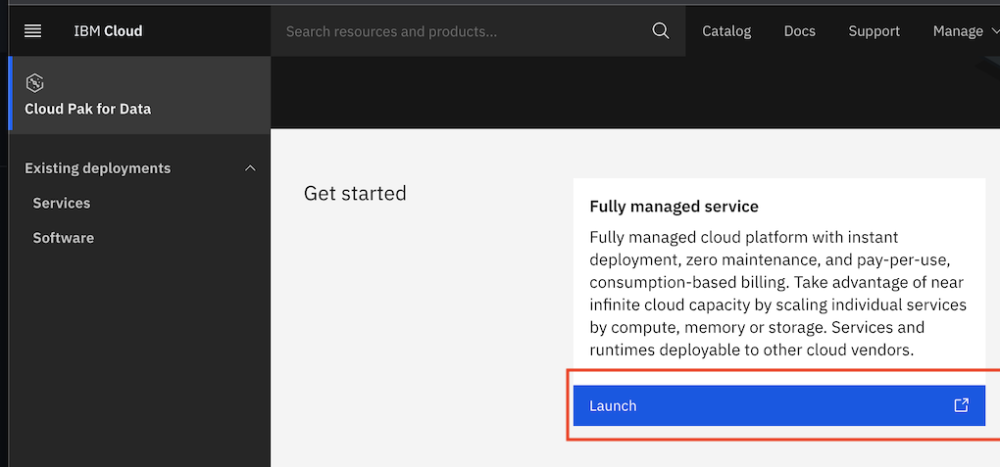
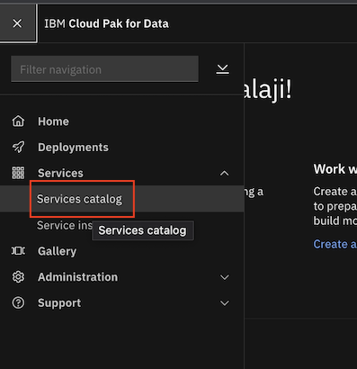
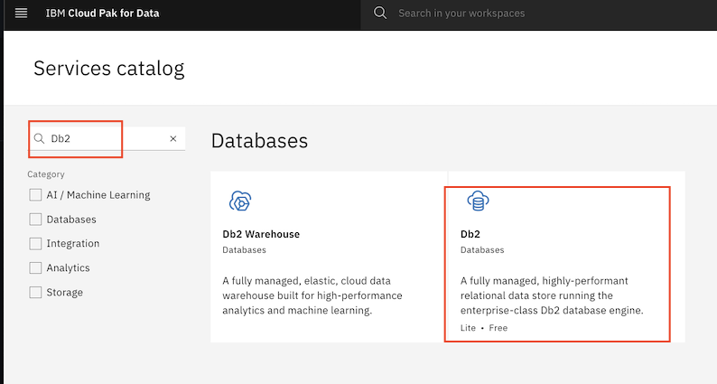
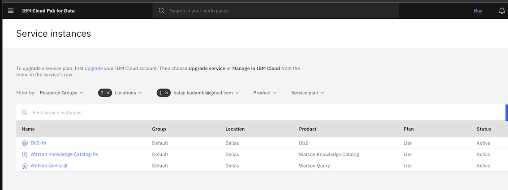
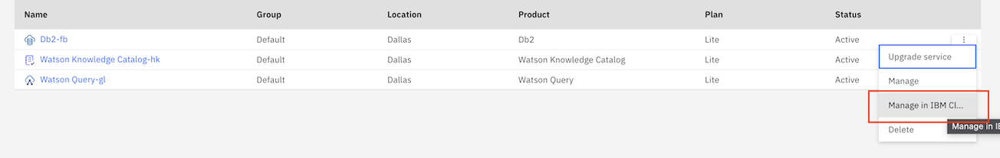
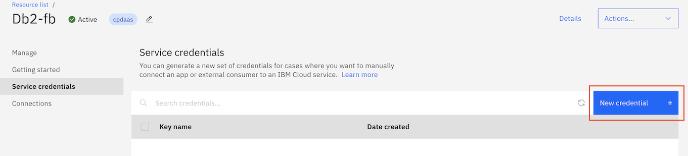
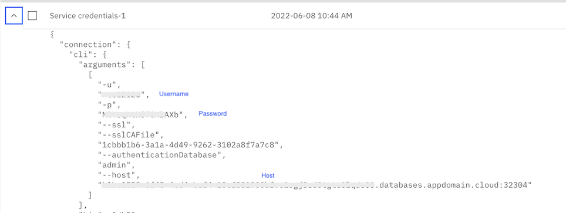

### Create DB2, Watson Knowledge Studio, Watson Query and Watson Assitant on the fully managed Cloud Pak for Data service(CPDaaS) on IBM Cloud 

This code pattern requires two IBM Cloud accounts. 
- The first account will be used to host the DB2 instance, Watson Knowledge Studio, Watson Query service and the Insurance Portal application.
- The second account will host the chatbot application.

Here afterwards, we will refer to the first account as the `Data Owner` IBM Cloud account and the second account as the `Data Collaborator` IBM Cloud account.

#### 1. Launch the Cloud Pak For Data console. 

Login to the `Data Owner` IBM Cloud account, and go to https://cloud.ibm.com/cloudpaks/data/overview. Click on `Launch` for fully managed service.

#### 2. Go to Services Catalog 

#### 3. Create DB2 Instance

Search for `Db2` in the catalog. Click on `Db2` to create Db2 instance. Select the plan as `Lite`. Click `Create`.

#### 4. Create Watson Knowledge Catalog Instance

Search for `Watson Knowledge Catalog` in the catalog. Click on `Watson Knowledge Catalog` to create `Watson Knowledge Catalog` instance. Select the plan as `Lite`. Click `Create`.

#### 5. Create Watson Query Instance

Search for `Watson Query` in the catalog. Click on `Watson Query` to create `Watson Query` instance. Select the plan as `Lite`. Click `Create`.

Select `Service Instances` in the left top hamburger menu. Note all the services have been created and are in `Active` state.

##### 5.1 Note down Watson Query credentials
Open the Watson Query console. Select `Connection details` in the dropdown menu. Note the `Host name`, `Port`, `User id` and `JDBC` string. This will be required for viewing the data on `Watson Knowledge Studio`.

#### 6. Create Watson Assistant

Search for `Watson Assistant` in the catalog. Click on `Watson Assistant` to create `Watson Assistant` instance. Select `Trial` plan and check the license agreement after reading the terms. Click create. It will take a minute or two for the Watson Assistant instance to be provisioned on your IBM Cloud dashboard.

#### 7. Create service credentials for DB2

In the services list, click on the D2 service instance and select `Manage on IBM Cloud` on the menu. 

Select `Service credentials` and click on `New Credential`.

**Note the username, password, host and port of the DB2 instance. The will be needed for configuring Insurance Portal Application, Watson Knowledge Catalog and Watson Query**

Back to main [README](README.md#2-create-ibm-cloud-services-instances).
