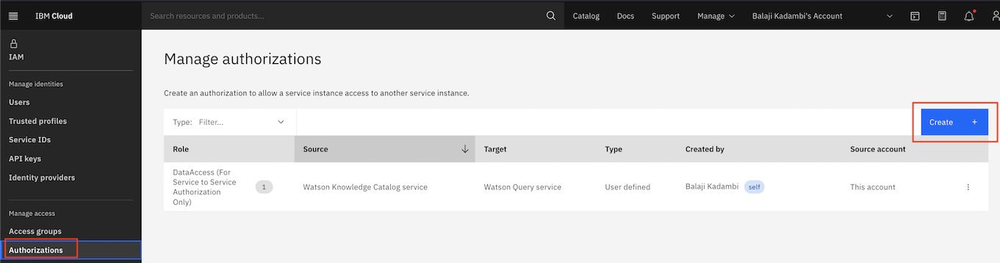
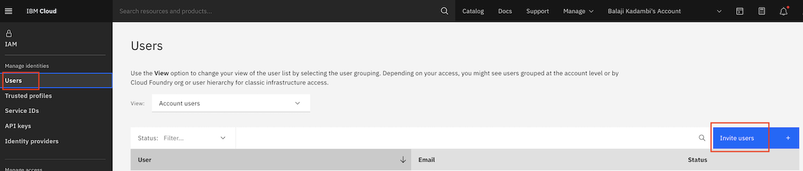
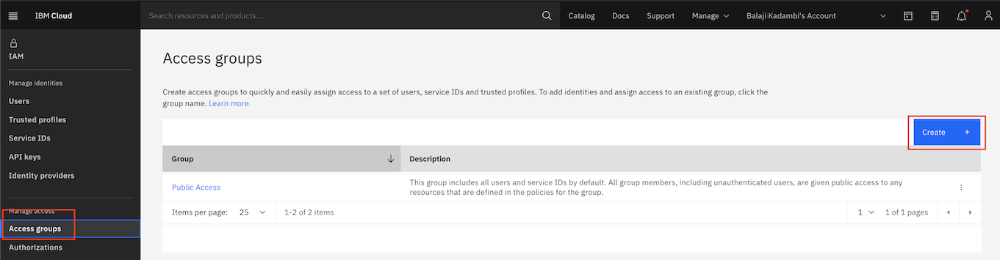
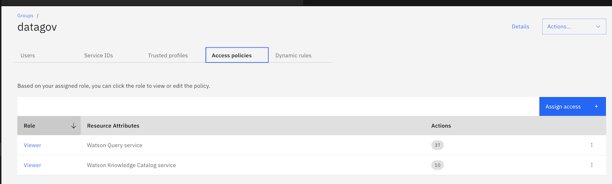
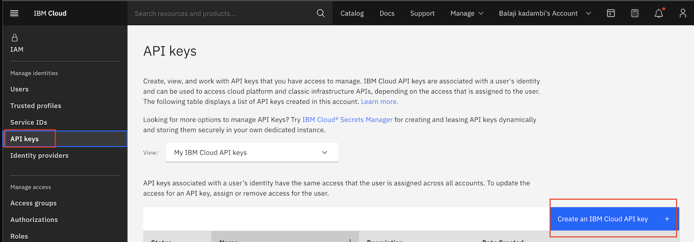

## Set up Identity and Access Management policies on the IBM Cloud accounts

There are three areas of access policies that need to be configured:
- The Watson Knowledge Catalog service needs an authorization to access the Watson Query service in the `Data Owner` IBM Cloud account.
- The `Data Collaborator` IBM Cloud account will need to be provided access to the data assets in the `Data Owner` IBM Cloud account.
- The Chatbot application will access the Watson Query service in the `Data Owner` IBM Cloud account. This requires an API Key to be created in the `Data Collaborator` IBM Cloud Account.

### 1. Configure service to service authorization for Watson Knowledge Catalog to access Watson Query service

- Login to the `Data Owner` IBM Cloud account.
- Click on `Manage`  and select `Access(IAM)` on the top navigation menu.
- Click on `Authorizations` on the left navigation menu. Click `Create` to create a service authorization as shown.

### 2. Provide needed access to the `Data Collaborator` IBM Cloud account

- Login to the `Data Owner` IBM Cloud account.
- Click on `Manage`  and select `Access(IAM)` on the top navigation menu.
- Click on `Authorizations` on the left navigation menu. Click `Invite user` and enter the `E-mail` address of the `Data Collaborator` IBM Account.
- Login to the `Data Collaborator` IBM cloud account and accept the invitation.

- Next, go back to the `Data Owner` cloud account, and click on `Access groups` on the left navigation menu. Click `Create`. Enter `datagov` as the name of the access group.

- Click on the `Users` tab of the newly created access group `datagov` and add the `Data Collaborator` IBM account user.
- Click on the `Access Policies` tab and provide `Viewer` role to the Watson Knowledge Catalog and Watson Query services.

### 3. Create IBM Cloud API key in `Data Collaborator` IBM Cloud account

- Login to the `Data Collaborator` IBM Cloud account.
- Click on `Manage`  and select `Access(IAM)` on the top navigation menu.
- Click on `API Keys` on the left navigation menu. Click on `Create an IBM Cloud API Key`. Make a note of the key. This will be required for the chatbot application

