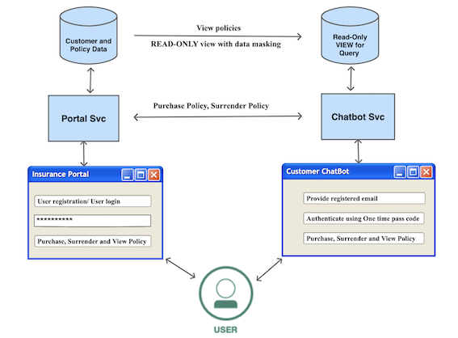
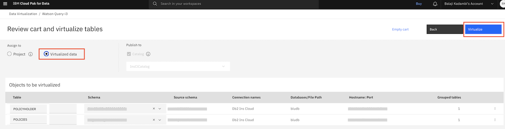
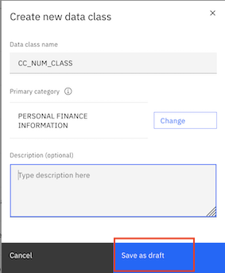
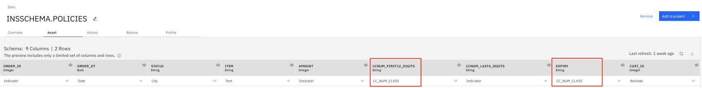

# Implement data security and privacy for shared data between applications

Data Security & Privacy related laws and regulations have become more stringent and at the same time businesses are expected to open for ecosystem partners. This makes data governance very critical to avoid litigation, loss of competitive position and trust. 

A collaborating application from within the enterprise or an ecosystem partner could require access to a data source for both read and write operations. A read operation must hence mask sensitive data  such as name, location, contact details, date of birth, credit card number, financial details and more. The write operation must ensure all the data policies are enforced. In such a scenario, a data governance framework plays a critical role to enforce data security and privacy at the same time be an enabler for business to achieve their strategy. 

The code pattern [Mask data for AI applications for security and privacy conformance](https://developer.ibm.com/patterns/create-read-only-view-of-data-with-sensitive-personal-information-masked-for-ai-apps/) demonstrated a methodology to mask sensitive data for a collaborating application. This code pattern demonstrates the following aspects:
- Mask sensitive data for a collaborating application from within the enterprise or ecosystem pattern.
- Authentication when the collaborating application is a chatbot ensuring data security.
- Maintain control and enforce data policies when the collaborating application writes back to the data source.

Let us consider the following scenario. There is an insurance portal application where a customer can register, sign in, purchase a policy, view policy details and surrender a policy. Currently all this functionality is available on a web portal. The business wants to expand the reach of its application, and use the new systems of engagement with customers. Chatbots are becoming increasingly common these days. It is a very convenient, and also a preferred way for customers to interact with businesses. It was decided to build a chatbot application that will co-exist with the web portal with the following features:
- Register as a user 
- Sign in to the chatbot
- Buy an insurance policy
- View all policy details
- Surrender a policy

The web portal application owns the data and is responsible for enforcing the data policies. Now, it can be seen here that the Chatbot application needs to having the following capabilities:
- Read access to data from the web portal application with sesitive data masked.
- Write access to data with data policies enforced.
- Authenticate users of the chatbot.

The data security requirements are as follows:
- The web portal application owns the data and hence performs all write operations on the data with data policies enforced.
- The chatbot application performs write operations on the data by invoking APIs exposed by the web portal application. This ensures control over the data and data security.
- Every request from the chatbot application to the web portal application must be authenticated.
- The chatbot application must have read access to the data with sensitive information like credit card number masked.



>Note: To keep the web portal application simple, we will build only the APIs for the web portal application. We will refer to it as `Portal Svc`. The focus of this code pattern is on the chatbot application.

In this code pattern, you will learn how to:
- Set up data assets for governance in the Watson Knowledge Catalog
- Create data categories, classes, business terms and data protection rules for the data assets
- Create virtualized view of the data on Watson Query with data policies enforced
- Create a chatbot aapplication using Watson Assistant that invokes APIs exposed by the `Portal Svc` for writing data to the data source, and consumes the read-only data with sensitive information masked from Watson Query.

Security Verify has been used to implement authentication for the Chatbot application.

## Flow


1. Create tables in Db2. The Db2 connection and the tables(as `Data Asset`) are added to the `Watson Knowledge Catalog(WKC)`. The data policies are configured for the data assets in `WKC`.
2. Db2 is added as a data source in Watson Query. The needed tables are virtualized and a `View` is created by joining the virtualized tables. 
3. The Watson Query virtualized tables and view are published to `WKC`. The data policies are configured for the data assets in `WKC`.
4. User accesses the chatbot. User is provided the option to `Register as a user` or `Login`.
5. In case of a new user, User is provided a web url for registration. In case of existing user, the User is authenticated using a one-time passcode sent to the user's email address.
6. User accesses the registration link hosted on the `Portal Svc`. User fills up the registration form with details.
7. A new user is created in Security Verify, and a record is added in Db2 table with other customer details.
8. The user after a successful authentication of one-time passcode can perform the following operations that involves a write operation to the data source - `Buy a Policy` or `Surrender a Policy`. The `Portal Svc` APIs for the operation is invoked. The `Portal Svc` validates the request with `Security Verify` using `Token Introspection`.
9. The `Portal Svc` then writes to the Db2 database with the data policies applied for the invoked operations.
10. The response from the `Portal Svc` is returned to `Watson Assistant`, `Chatbot Svc` and eventually to the end user accessing the chatbot interface.
11. The user requests to `View Active policies` or `View All policies`.  Since this a read operation, the request goes to `Chatbot Svc`. The `Chatbot Svc` validates the request with `Security Verify` using `Token Introspection`. 
12. The `Chatbot Svc` accesses `Watson Query` to get the results. The data policies are applied to mask sensitive data in the results.
13. All responses are sent back to the user on the chatbot interface.
 

## Pre-requisites

* IBM Cloud account
* OpenShift Cluster
* IBM Security Verify account
* Git client

## Steps

1. [Clone the repository](#1-clone-the-repository)
2. [Create IBM Cloud Services](#2-create-ibm-cloud-services)
3. [Configure Security Verify](#3-configure-security-verify)
4. [Provide access for collaborators to Cloud Pak for Data](#4-provide-access-for-collaborators-to-cloud-pak-for-data)
5. [Create Cloud Functions Action](#5-create-cloud-functions-action)
6. [Setup Watson Assistant Chatbot](#6-setup-watson-assistant-chatbot)
7. [Deploy Applications](#7-deploy-applications)
8. [Configure Watson Query](#8-configure-watson-query)
9. [Configure Watson Knowledge Studio](#9-configure-watson-knowledge-studio)
10. [Access the Application](#10-access-the-application)
11. [Summary](#11-summary)

### 1. Clone the repository

From a command terminal, run the below command to clone the repo:

```
git clone https://github.com/IBM/data-governance-insurance-chatbot-app
```
### 2. Create IBM Cloud Services

#### 2.1 Create DB2, Watson Knowledge Catalog and Watson Query service instances on Cloud Pak for Data

In the code pattern, we will be using Cloud Pak for Data.

[Cloud Pak For Data](https://cloud.ibm.com/cloudpaks/data/overview) is available in two modes -
- [Fully-managed service](https://cloud.ibm.com/cloudpaks/data/overview) 
- [Self-managed software](https://cloud.ibm.com/catalog/content/ibm-cp-datacore-6825cc5d-dbf8-4ba2-ad98-690e6f221701-global)

##### 2.1.1 For fully managed service, click [here](CPDaaS.md) and follow the steps.

##### 2.1.2 For self managed software, click [here](CPD.md) and follow the steps.

##### 2.1.3 Create a catalog in Watson Knowledge Studio for Insurance Portal Application

Go to the Watson Knowledge Studio console. Select `View All Catalogs` on the hamburger menu on the top left.

Click on `Create Catalog`.


Enter a name for the catalog (say `InsClCatalog`). Enter a description. Select `Enforce data policies`. Click `Create`.


#### 2.2 Sign up for IBM Security Verify

Click [Security Verify](https://www.ibm.com/account/reg/signup?formid=urx-30041) to sign up for Security Verify. After you sign up for an account, the account URL (https://[tenant name].verify.ibm.com/ui/admin) and password is sent in an email.

#### 2.3 Create an OpenShift cluster to deploy applications

>Note: If you are using a Cloud Pak For Data as a self managed software, the same cluster can be used for application deployment.

Go to this [link](https://cloud.ibm.com/kubernetes/catalog/create?platformType=openshift) to create an instance of OpenShift cluster.

Make a note of the `Ingress Subdomain URL`:


### 3. Configure Security Verify

Please follow the instructions [here](SECURITY_VERIFY_CONFIG.md) to configure Security Verify.

### 4. Provide access for collaborators to Cloud Pak for Data

For fully managed service, click [here](CPDaaS_Access.md) and follow the steps.

For self managed software, click [here](CPD_Access.md) and follow the steps.

### 5. Create Cloud Functions Action

Login to your IBM Cloud account. On the dashboard, click on the hamburger menu and navigate to `Functions` and click on `Actions`.

Click the `Create` button to create a new action. 
Enter a name for action under `Action Name`. Leave `Enclosing Package` as `(Default Package)` itself. Under `Runtime` select option for Node.js.

Click on `Create` button. You are presented with actions code editor. Replace the existing code with the javascript code [here](https://github.com/IBM/secure-chatbot-interactions-using-security-verify/blob/main/sources/chatbot/cloud-function/function.js).

Next, in the javascript code, update the value of following variables (mentioned in the beginning of the file):

```
//Security Verify Details
var tenant_url = "xxxx.verify.ibm.com"
var client_id = "xxxx"
var client_secret = "xxxx"

//API Details
var REGISTRATION_API_URL = "http://<openshift_url>/ins/portalsvc/register";
var BUY_POLICY_API_URL = "http://<openshift_url>/ins/portalsvc/createpolicy";
var SURRENDER_POLICY_API_URL = "http://<openshift_url>/ins/portalsvc/surrpolicy";
var VIEW_ACTIVE_POLICIES_API_URL = "http://<openshift_url>/ins/chatbotsvc/getallactivepolicies";
var VIEW_ALL_POLICIES_API_URL = "http://<openshift_url>/ins/chatbotsvc/getallpolicies";
```

>Note: Please use the security verify credentials noted in step 3 and replace `openshift_url` by the `OpenShift ingress subdomain url` as noted in step 2.4.

Click `Save` button on the top right of the code editor. 

#### Enable cloud function action as web action

For the action just created, click `Endpoints` on the left side navigation menu. Select the checkbox `Enable as Web Action`. Click the `Save` button on the right top corner. When saved, `Copy web action url` icon, under `Web Action` section is enabled. Click the icon to copy the webhook url. This URL will be used in Watson Assistant for it to call the actions in Cloud Functions.


### 6. Setup Watson Assistant Chatbot

Login to IBM Cloud. On the dashboard, click on the hamburger menu and click `Resource List`. Click on the Watson Assistant instance that you created earlier. Then click on `Launch Watson Assistant` button to launch Watson Assistant dashboard.

- In the Watson Assistant home page, click `Create New +` option on the top panel.
- Provide a name of your choice, say `InsuranceBot` and click `Create assistant`.
- Navigate to `Assistant Settings` in the left panel towards down. Under the Dialog section, click on `Activate Dialog`. Now, Dialog will be visible as one of the options in the left panel.
- Click on `Dialog > Options > Upload/Download` and provide a json file available at `<cloned repo>/sources/chatbot/dialog/`. Click `Upload`.
- On the left navigation links click `Options > Webhooks` and in `URL` text field, enter the REST API endpoint as noted in step 4 and append it with .json.  It should look something like this
	```
	https://eu-gb.functions.appdomain.cloud/api/v1/web/.../default/sample.json
	```
	Now the chatbot is ready to use.
- On the left panel, click the `Preview` button. 
- Click on `Customize web chat` button presented in top-right corner. Here you can make changes as per your choice.
- The following changes were made for this code pattern:
	- Under `Home Screen` tab, toggle a button to set it `off`.
	- Click on `Save and Exit`.
- Now, chatbot can be used in this preview window. 
- Optional: If you wish to embed this chatbot onto your portal, go to `Preview > Customize web chat > Embed (tab)`. It shows a code snippet like:
	```
	<script>
	  window.watsonAssistantChatOptions = {
	    integrationID: "cxxx0", // The ID of this integration.
	    region: "us-south", // The region your integration is hosted in.
	    serviceInstanceID: "fexxxa", // The ID of your service instance.
	    onLoad: function(instance) { instance.render(); }
	  };
	  setTimeout(function(){
	    const t=document.createElement('script');
	    t.src="https://web-chat.global.assistant.watson.appdomain.cloud/versions/" + (window.watsonAssistantChatOptions.clientVersion || 'latest') + "/WatsonAssistantChatEntry.js";
	    document.head.appendChild(t);
	  });
	</script>
	```

	Copy this code and paste on the homepage of the portal application. The chatbot will be integrated with your portal.

Note that this code pattern uses the preview option to ease the process.

### 7. Deploy applications

#### 7.1 Deploy Portal Service

##### 7.1.1 Configure db.config

In the cloned repo folder - go to `sources/portal-svc/src/main/resources`. Open `db.config`.

Replace the {{host}} and {{port}} with the host and port you noted during Db2 credentials creation. Enter the userid, password and schema with the username, password and username(in uppercase). Save the file.
> Note: the schema should be in uppercase of the username noted in Db2 credentials.
```
jdbcurl=jdbc:db2://{{host}}:{{port}}/bludb:sslConnection=true;
userid=
password=
schema=
```

##### 7.1.2 Changes to verify.config
In the cloned repo folder - go to `sources/portal-svc/src/main/resources`. Open `verify.config`.

Make the below changes and save the file:
- Replace {{tenant-id}} with the tenant id of Security Verify noted at the time of creation.
- For `clientId` and `clientSecret` enter the Client ID and Client secret noted on the `Sign-on` tab of Security Verify.
- For `apiClientId` and `apiClientSecret` enter the Client ID and Client secret noted on the `API Access` tab of Security Verify.

```
introspectionUrl=https://{{tenant-id}}.verify.ibm.com/v1.0/endpoint/default/introspect
tokenUrl=https://{{tenant-id}}.verify.ibm.com/v1.0/endpoint/default/token
userInfoUrl=https://{{tenant-id}}.verify.ibm.com/v1.0/endpoint/default/userinfo
clientId=
clientSecret=
usersUrl=https://{{tenant-id}}.verify.ibm.com/v2.0/Users
apiClientId=
apiClientSecret=
```

##### 7.1.3 Deploy application to the OpenShift cluster
On the terminal window, got to the repository folder that we cloned earlier. 
Go to the directory - `sources/portal-svc/src/main/java/com/example/portalsvc/rest/`.
Open the file `PortalSvcEndpoint.java`.

Replace the placeholder `{{ingress-sub-domain}}` with the ingress sub domain of the OpenShift cluster you noted earlier. Save the file.
```
private static String ingressSubDomain = "portal-svc-governance.{{ingress-sub-domain}}/";
```

Now change directory to `/sources/portal-svc` in the cloned repo folder.
Run the following commands to deploy `Portal Service`.
```
oc new-project governance
mvn clean install
oc new-app . --name=portal-svc --strategy=docker
oc start-build portal-svc --from-dir=.
oc logs -f bc/portal-svc
oc expose svc/portal-svc
```
Ensure that the application is started successfully using the command `oc get pods`. Also make a note of the route using the command `oc get routes`. 

##### 7.1.4 Configure Db2 database

In this step, we will create two tables in the Db2 database - CUSTOMER and ORDERS table.

Invoke the URL - http://portal-svc-governance.{{IngressSubdomainURL}}/ins/portalsvc/setupdb

>Note: Replace {{IngressSubdomainURL}} with `Ingress subdomain` of the OpenShift cluster.

#### 7.2 Deploy Chatbot Service

##### 7.2.1 Configure db.config

In the cloned repo folder - go to `sources/chatbot-svc/src/main/resources`. Open `db.config`.

Here, you need to enter the `Watson Query` credentials noted earlier.  For mode, specify `managed` if using the SaaS version of Cloud Pak for Data, and `self` if Cloud Pak for Data is deployed on self-managed OpenShift cluster.  Specify the `JDBC url` for the `Watson Query`. The JDBC url will have `apikey` embedded for `managed` mode. This `apikey` is what was generated on the `Data Collaborator` IBM Cloud account.
For a self-managed cluster, enter the user id and password of the collaborator user. Save the file.

```
jdbcurl=jdbc:db2://
mode=managed
userid=
password=
schema=INSSCHEMA
```

##### 7.2.2 Changes to verify.config
In the cloned repo folder - go to `sources/chatbot-svc/src/main/resources`. Open `verify.config`.

Make the below changes and save the file:
- Replace {{tenant-id}} with the tenant id of Security Verify noted at the time of creation.
- For `clientId` and `clientSecret` enter the Client ID and Client secret noted on the `Sign-on` tab of Security Verify.
- For `apiClientId` and `apiClientSecret` enter the Client ID and Client secret noted on the `API Access` tab of Security Verify.

```
introspectionUrl=https://{{tenant-id}}.verify.ibm.com/v1.0/endpoint/default/introspect
tokenUrl=https://{{tenant-id}}.verify.ibm.com/v1.0/endpoint/default/token
userInfoUrl=https://{{tenant-id}}.verify.ibm.com/v1.0/endpoint/default/userinfo
clientId=
clientSecret=
usersUrl=https://{{tenant-id}}.verify.ibm.com/v2.0/Users
apiClientId=
apiClientSecret=
```

##### 7.2.3 Deploy application to the OpenShift cluster
On the terminal window, got to the repository folder that we cloned earlier. 
Now change directory to `/sources/chatbot-svc` in the cloned repo folder.
Run the following commands to deploy `Portal Service`.
```
oc new-project governance
mvn clean install
oc new-app . --name=chatbot-svc --strategy=docker
oc start-build chatbot-svc --from-dir=.
oc logs -f bc/chatbot-svc
oc expose svc/chatbot-svc
```
Ensure that the application is started successfully using the command `oc get pods`. Also make a note of the route using the command `oc get routes`. 

### 8. Configure Watson Query

Login to `Cloud Pak for Data` with `Data Owner` credentials. Go to the Watson Query console.

#### 8.1 Enforce data policies

Select `Service settings` in the dropdown menu. Click on `Governance` tab. Enable `Enforce policies within Data Virtualization` and `Enforce publishing to a governed catalog`.


#### 8.2 Add Db2 connection 

Select `Data Sources` in the dropdown menu. Click on `Add Connection`.  Select `Db2 on Cloud` if the instance is on IBM Cloud. Enter the `Db2` credentials that you noted earlier, and create the connection.


#### 8.3 Create schema

Select `Schemas` in the dropdown menu. Click on `New schema` with a name say `INSSCHEMA`.


#### 8.4 Virtualize POLICY_HOLDER and POLICIES tables

Select `Schemas` in the dropdown menu. Select the `POLICY_HOLDER` and `POLICIES` tables. Add to Cart. Go to the cart, select `Virtualized data` option and click on `Virtualize` as shown.



#### 8.5 Create a POLICYHOLDER_POLICIES_VIEW

Select `Virtualized data`  in the dropdown menu. Select `POLICY_HOLDER` and `POLICIES` table. Click on `Join`. In the next page, create a join key from `CUST_ID` of `POLICY_HOLDER` table to `CUST_ID` of `POLICIES` table.


On the next page, select `Virtualized data` option. Click `Create View`.


#### 8.6 Provide user access to `Data Collaborator`

Select `Virtualized data`  in the dropdown menu. For the `POLICYHOLDER_POLICIES_VIEW` select `Manage Access`. On the access page, click on `Grant Access` and provide access to the `Data Collaborator` user.


### 9. Configure Watson Knowledge Studio

Login to `Cloud Pak for Data` with `Data Owner` credentials. Go to the Watson Query console.

#### 9.1 View the catalog and data assets
	
Click `View All Catalogs` on the left hamburger menu. Click on the catalog that you created earlier. All the Watson Query Data Assets should appear as shown.


Click on the `INSSCHEMA.POLICY_HOLDER` data asset. Click on the `Asset` tab. 
	
Enter the connection details of Watson Query noted earlier.
	
If it is a fully managed Cloud Pak for Data service:
- On the IBM Cloud Dashboard, go to `Manage` and select `Access (IAM`). Create an IBM Cloud API Key. Note the API key.
- On the `Asset` tab, select API Key as the mode of authentication.
- Enter the API key noted in the earlier step, and click `Connect`.

If it is a self managed software for Cloud Pak for Data:
- Enter the `Data Owner` credentials for Cloud Pak for Data.

The data should now be visible on the `Asset` tab:

	
#### 9.1.1 Create a data profile
	
For each of the assets - `INSSCHEMA.POLICY_HOLDER`,`INSSCHEMA.POLICIES` and `INSSCHEMA.POLICYHOLDER_POLICIES_VIEW`, go to the `Profile` tab and click `Create Profile`.


	
#### 9.2 Create a category

Click `View All Catalogs` on the left hamburger menu. Click on `Add category` and select `New category`.


	
Create a category for personal financial information. Enter a `name` and click `Create`.
	
#### 9.3 Create a data class

Click `Data classes` on the left hamburger menu. Click on `Add data class` and select `New data class`.	

Enter details as shown and click `Create`.

	

This will be saved as `Draft`. Click `Publish` to publish the data class.


	
#### 9.4 Create a business term

Click `Business terms` on the left hamburger menu. Click on `Add business term` and select `New business term`.	

Enter details as shown and click `Create`.


	
This will be saved as `Draft`. Click `Publish` to publish the business term.

#### 9.5 Assign data class to the columns

Open the `Asset` tab for `ORDERS` table. Assign the data class `CC_NUM_CLASS` created earlier to the credit card information columns.


	
Open the `Asset` tab for `POLICY_HOLDER` table. Verify the data class assignment for mobile and email columns.

	
	
#### 9.6 Create a data protection rule

Click `Rules` on the left hamburger menu. Click on `Add rule` and select `New rule`.	
Next select `Data protection rule`. Configure the rule as shown. This rule will mask the credit card data for collaborators. Click on `Create`. 


Similarly, you can add rules for masking mobile, email and credit card expiry information.

	

#### 9.7 View of data for `Data Owner` and `Data Collaborator`

Login to Watson Query with `Data Owner` credentials. `Preview` the `POLICYHOLDER_POLICIES_VIEW`.

	
	
Login to Watson Query with `Data Collaborator` credentials. `Preview` the `POLICYHOLDER_POLICIES_VIEW`.


In the next section, let us access the application and see the data privacy policies enforced for the chatbot.

### 10. Access the application

As mentioned in step 6, this code pattern uses the preview of chatbot provided by Watson Assistant service. To access the chatbot, go to Watson Assistant Service instance link on your cloud resources, click `Launch Watson Assistant` and then click on `Preview` in the left panel. Now you can converse with chatbot as shown.


### 11. Summary
In this code pattern you saw how to set up a data governance framework with security using Watson Knowledge Catalog, Watson Query and Security Verify to enforce data policies for a collaborating chatbot application. You saw how both write and read operations can be supported for a collaborating application while enforcing data policies.


## License
This code pattern is licensed under the Apache License, Version 2. Separate third-party code objects invoked within this code pattern are licensed by their respective providers pursuant to their own separate licenses. Contributions are subject to the [Developer Certificate of Origin, Version 1.1](https://developercertificate.org/) and the [Apache License, Version 2](https://www.apache.org/licenses/LICENSE-2.0.txt).

[Apache License FAQ](https://www.apache.org/foundation/license-faq.html#WhatDoesItMEAN)
