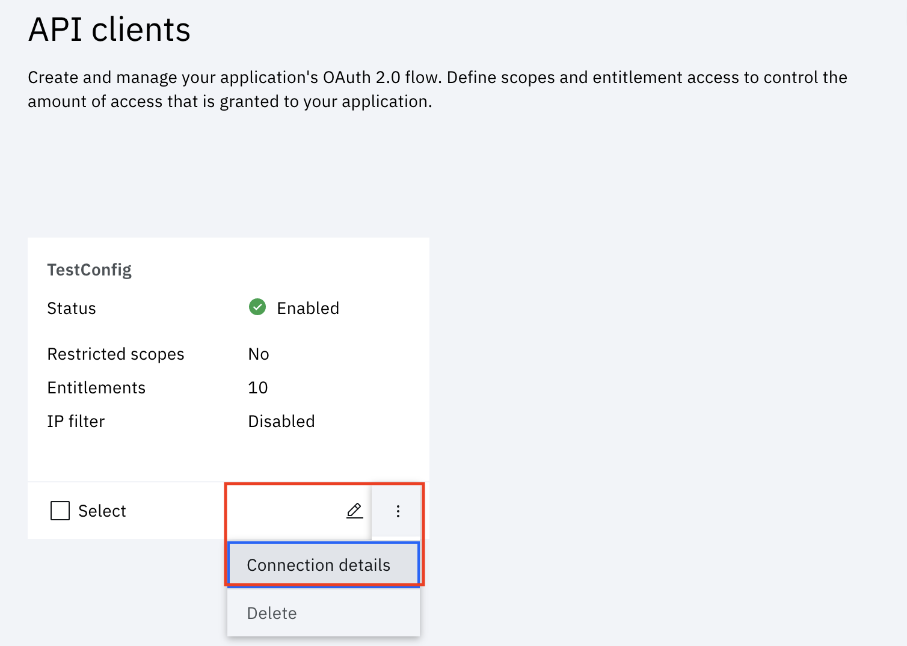

### Configure Security Verify

**Create an API client and enable MFA**
- Login to Security Verify. Use the URL for your admin account that was sent to you in the confirmation email: https://[tenant id].verify.ibm.com/ui/admin.
>Note down the tenant id. This will be required to configure the Portal application and Chatbot application.
<!-- TODO changes needed here -->
- On the Security Verify dashboard, click on `Security` in the left panel.
- Click on the `API Access`.
- Click on `Add API Client` button. We need to create a privileged client so that the management APIs can be used in the application.
- Choose the following entitlements:

  * Authenticate any user
  * Generate OTP
  * Manage API Clients
  * Manage entitlements
  * Manage authenticator registrations of all users
  * Manage users and standard groups
  * Read authenticator registration of all users
  * Read second-factor authentication enrollment for all users
  * Read users and groups
Click Next.
- Use other default vaules and provide the name. Click `Create API Client`.
- The credentials will now be generated.

**Get the credentials**

Click on three dots to get connection details as shown.

Copy the client id and secret. It will be used in Cloud function.

Back to main [README.md](README.md#3-configure-security-verify) page.
